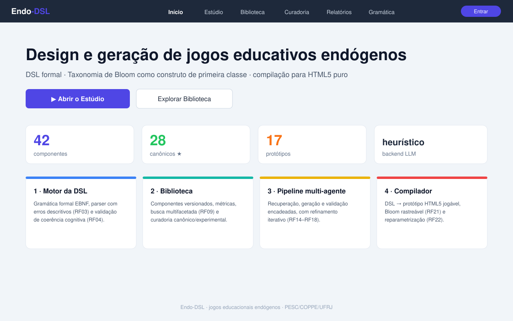
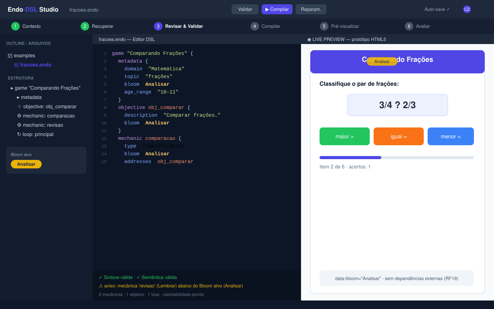
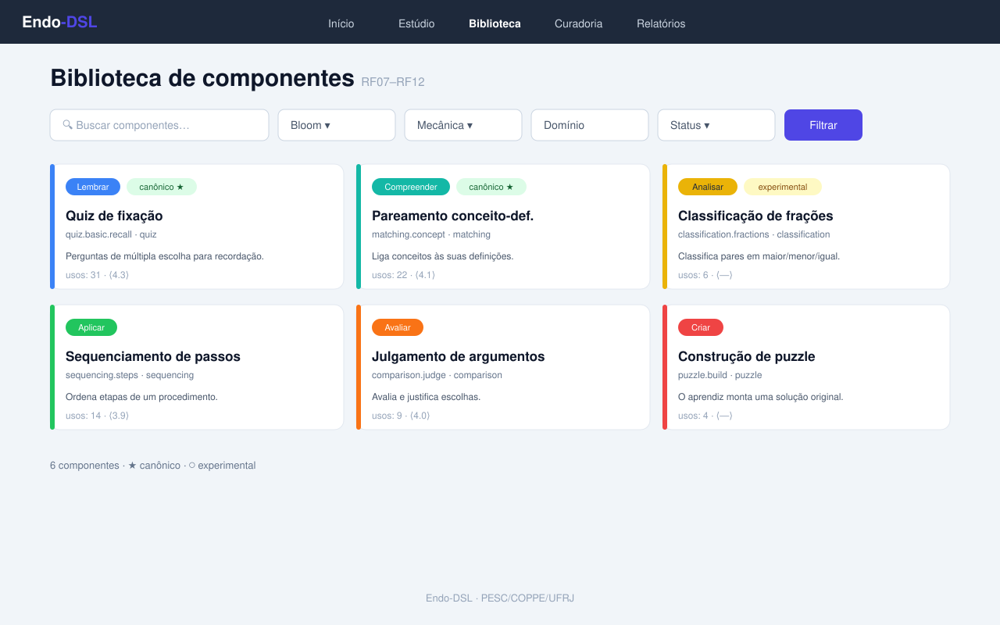
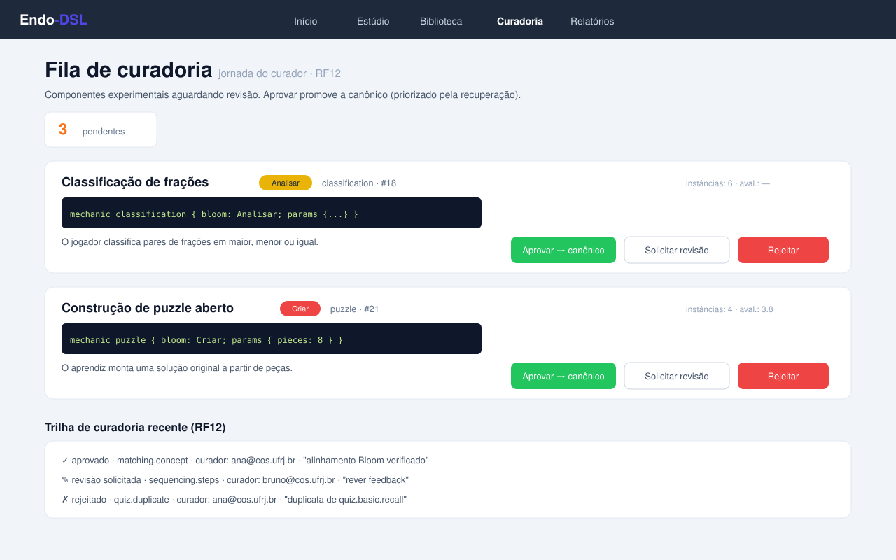
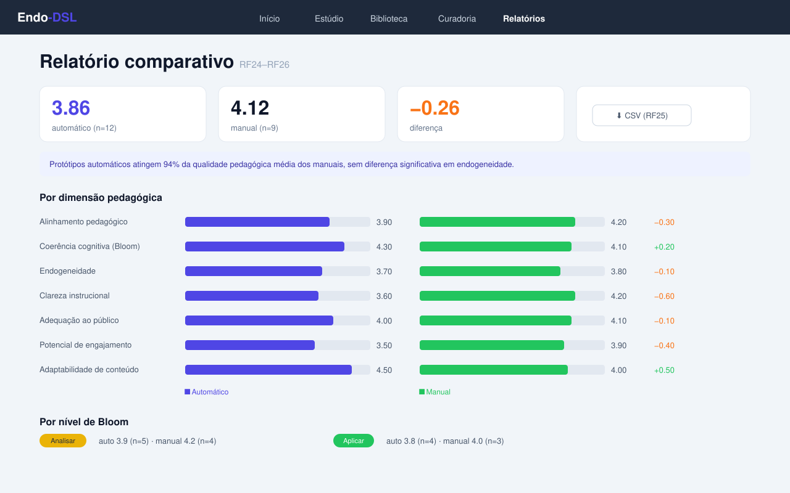
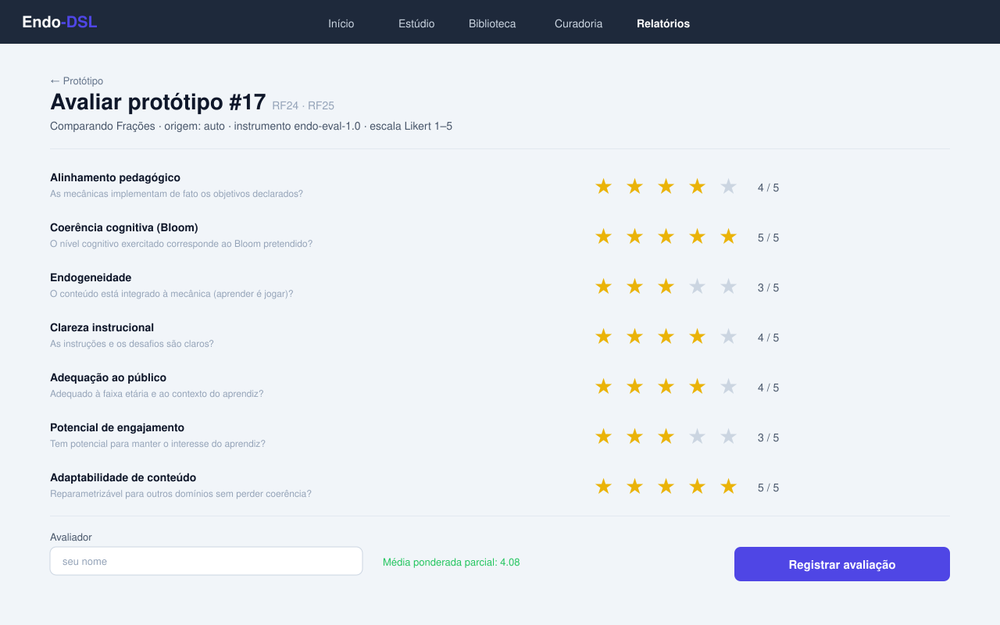
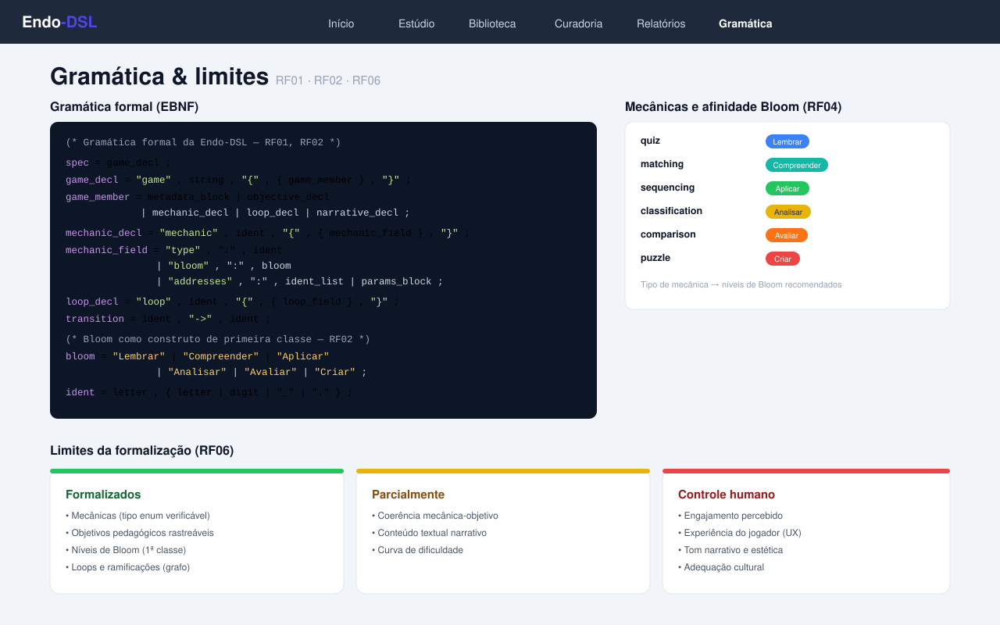
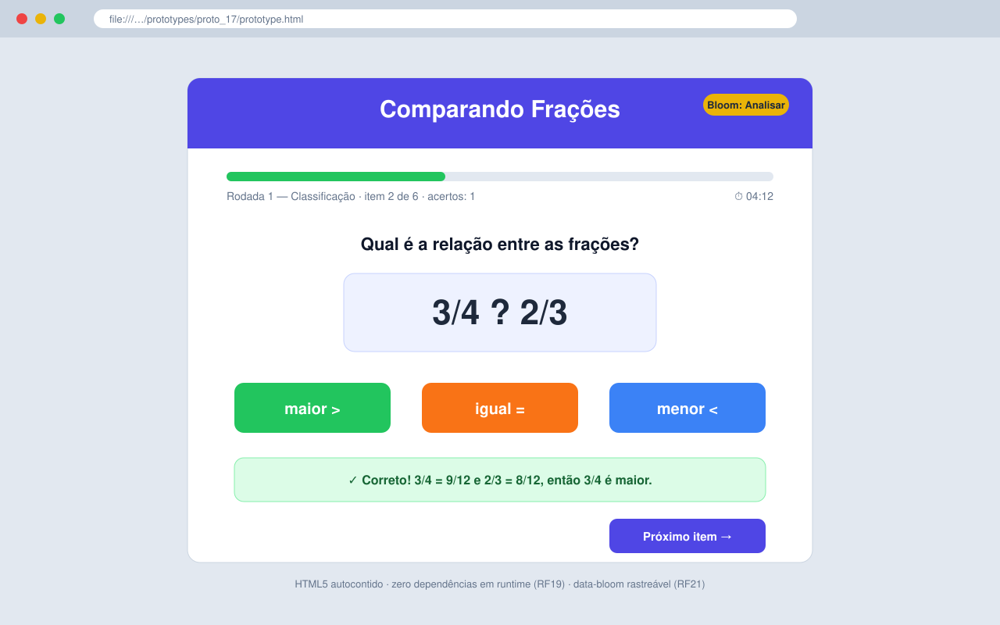

# Manual de Utilização — Endo-DSL

> Guia da jornada completa do usuário na interface web da **Endo-DSL**, com
> telas ilustradas e histórias de usuário. Voltado a professores, designers
> instrucionais, pesquisadores, curadores e administradores.

Para iniciar a interface:

```bash
endo-dsl serve --port 8000   # acesse http://localhost:8000
```

> As imagens deste manual estão em `docs/screenshots/` no formato SVG (vetorial,
> renderizado por navegadores e pelo GitHub). Caso uma versão `.png` exista no
> mesmo diretório, os visualizadores que não suportam SVG a utilizarão.

---

## Sumário

1. [Tela inicial (dashboard)](#1-tela-inicial)
2. [Estúdio — editor tipo-Overleaf (Fases 1–6)](#2-estúdio)
3. [Biblioteca de componentes](#3-biblioteca)
4. [Curadoria (jornada do curador — Fase 7)](#4-curadoria)
5. [Relatórios comparativos](#5-relatórios)
6. [Avaliação pedagógica](#6-avaliação)
7. [Gramática e limites](#7-gramática)
8. [Protótipo executável](#8-protótipo)
9. [Histórias de usuário](#9-histórias-de-usuário)

---

## 1. Tela inicial



**Propósito.** Porta de entrada da plataforma. Apresenta a proposta, indicadores
agregados (componentes, canônicos, protótipos, backend LLM ativo) e atalhos para
o Estúdio e a Biblioteca.

**Como usar.**
- Clique em **▶ Abrir o Estúdio** para iniciar um novo design.
- Use **Explorar a Biblioteca** para reaproveitar componentes existentes.
- Os quatro cartões resumem os subsistemas (Motor da DSL, Biblioteca, Pipeline,
  Compilador) com os requisitos funcionais (RF) que cada um atende.

**Dicas.**
- O indicador "backend LLM" mostra `heuristic` quando não há `ANTHROPIC_API_KEY`;
  nesse modo tudo funciona offline e de forma determinística.

---

## 2. Estúdio



**Propósito.** Coração da plataforma — um ambiente de autoria com **layout
dividido tipo-Overleaf, porém melhor**: painel esquerdo com *outline*/arquivos,
editor central de DSL com **realce de sintaxe**, e **pré-visualização ao vivo** do
jogo compilado à direita. Um *stepper* superior guia as seis fases.

**Como usar — as seis fases.**

1. **Fase 1 — Contexto educacional (RF13).** Informe tema/domínio, tópico,
   objetivo de aprendizagem, nível de Bloom desejado, faixa etária, escolaridade
   e duração. Marque "Sem leitura extensiva" quando aplicável.
2. **Fase 2 — Recuperar componentes (RF14).** A plataforma busca componentes
   pedagógicos afins por similaridade. Selecione os que servirão de ponto de
   partida — ou use **Gerar do zero**.
3. **Fase 3 — Gerar especificação (RF15–RF18).** O pipeline produz a DSL e a
   exibe no editor central, já com metadados da geração.
4. **Fase 4 — Revisar & validar (RF05).** Edite livremente; a validação roda **ao
   vivo** (sintaxe + semântica), exibindo erros e avisos abaixo do editor. Este
   é o **ponto de controle humano** — onde julgamentos não formalizáveis
   (estética, tom, engajamento) são exercidos.
5. **Fase 5 — Compilar protótipo (RF19, RF22, RF23).** Gera o HTML5 jogável,
   abre a pré-visualização e disponibiliza a rastreabilidade.
6. **Fase 6 — Avaliar (RF24, RF25).** Abre o instrumento de avaliação
   multidimensional para o protótipo recém-gerado.

**Dicas.**
- O *stepper* permite voltar a fases anteriores sem perder o trabalho.
- Cores de Bloom no painel/editor ajudam a verificar visualmente a coerência
  cognitiva (ex.: amarelo = Analisar).
- Use o botão **Reparam.** para trocar o domínio do protótipo sem recompilar.

---

## 3. Biblioteca



**Propósito.** Catálogo navegável de componentes reutilizáveis, com filtros
multifacetados (RF09) e cartões coloridos por nível de Bloom.

**Como usar.**
- Combine os filtros **busca textual**, **Bloom**, **Mecânica**, **Domínio** e
  **Status** (canônico/experimental) e clique em **Filtrar**.
- Clique em um cartão para abrir a página do componente: assinatura DSL,
  parâmetros configuráveis, referências (RF08), métricas (RF11), histórico de
  versões (RF10) e trilha de curadoria (RF12).

**Dicas.**
- Componentes **canônicos ★** são priorizados pela recuperação automática.
- O selo de avaliação `⟨4.2⟩` e o número de **usos** ajudam a escolher os
  componentes mais maduros.

---

## 4. Curadoria



**Propósito.** Fila de revisão dos componentes **experimentais** submetidos pela
comunidade (Fase 7), com ações auditáveis (RF12).

**Como usar.**
- Para cada cartão, leia a assinatura DSL e a descrição e escolha:
  **Aprovar (→ canônico)**, **Solicitar revisão** ou **Rejeitar**.
- Toda ação registra curador e justificativa, formando uma trilha rastreável.

**Dicas.**
- Verifique a afinidade Bloom×mecânica antes de aprovar — é o principal critério
  formalizável de qualidade.
- Componentes com muitas instâncias e boa avaliação média são bons candidatos a
  canônico.

---

## 5. Relatórios



**Propósito.** Comparar protótipos **automáticos × manuais** nas sete dimensões
do instrumento, por nível de Bloom e por domínio (RF24–RF26).

**Como usar.**
- Leia os indicadores de topo (médias e diferença) e a interpretação textual.
- As barras por dimensão mostram lado a lado as médias auto (índigo) e manual
  (verde) e o delta.
- Exporte os dados brutos em **CSV (RF25)** para análise estatística externa.

**Dicas.**
- Diferenças pequenas e não significativas reforçam a tese de que a geração
  automática **aproxima-se** da qualidade manual.

---

## 6. Avaliação



**Propósito.** Instrumento estruturado (`endo-eval-1.0`) com **sete dimensões** em
escala Likert 1–5 cada (RF24): alinhamento pedagógico, coerência cognitiva,
endogeneidade, clareza instrucional, adequação ao público, potencial de
engajamento e adaptabilidade de conteúdo.

**Como usar.**
- Para cada dimensão, clique nas estrelas (1–5) conforme o julgamento.
- Informe seu nome (avaliador) e comentários e clique em **Registrar avaliação**.

**Dicas.**
- O mesmo instrumento é aplicado a protótipos auto e manuais, garantindo
  comparabilidade direta.
- As dimensões têm **pesos** (ex.: endogeneidade 1.3) na média ponderada.

---

## 7. Gramática



**Propósito.** Documentação viva da DSL: gramática EBNF (RF01/RF02), tabela de
mecânicas com afinidade cognitiva (RF04) e os limites da formalização (RF06).

**Como usar.**
- Consulte a EBNF como referência ao escrever DSL manualmente.
- Use a tabela mecânica×Bloom para escolher mecânicas coerentes com o objetivo.
- Os três grupos de limites (formalizado / parcial / humano) explicam **por que**
  certos aspectos ficam sob controle humano.

---

## 8. Protótipo



**Propósito.** O jogo HTML5 compilado, autocontido e jogável no navegador (RF19),
com níveis de Bloom rastreáveis em `data-bloom` (RF21).

**Como usar.**
- Abra `prototype.html` (link impresso pelo `compile`) ou navegue para
  `/prototype/<id>` na interface.
- Jogue: o conteúdo está **integrado à mecânica** (aprender é jogar), não
  justaposto — princípio da endogeneidade.

**Dicas.**
- Use **reparametrização** para reaproveitar o mesmo jogo em outro domínio.
- A página `/prototype/<id>/traceability` mostra como cada mecânica endereça os
  objetivos e os níveis de Bloom.

---

## 9. Histórias de usuário

Formato: *Como `<persona>`, quero `<objetivo>`, para `<benefício>`*, com critérios
de aceitação (CA) e referências às telas/comandos que as satisfazem.

### HU-01 — Professor do ensino fundamental
**Como** professor do 5º ano, **quero** gerar rapidamente um jogo de comparação de
frações alinhado ao currículo, **para** usar em aula sem saber programar.
- **CA1.** Informo contexto na Fase 1 e obtenho um protótipo jogável em poucos passos.
- **CA2.** Posso editar a DSL na Fase 4 e validar ao vivo.
- **CA3.** Abro o jogo no navegador sem instalar nada.
- **Telas/Comandos:** Estúdio (Fases 1–5), Protótipo · `generate --compile`, `compile`.

### HU-02 — Designer instrucional
**Como** designer instrucional, **quero** garantir que as mecânicas exercitem o
nível de Bloom pretendido, **para** assegurar coerência cognitiva.
- **CA1.** O editor sinaliza avisos quando a mecânica fica abaixo do Bloom alvo.
- **CA2.** Consulto a tabela mecânica×Bloom na tela de Gramática.
- **CA3.** A rastreabilidade confirma o mapeamento objetivo→mecânica→Bloom.
- **Telas/Comandos:** Estúdio (Fase 4), Gramática · `validate`, `grammar`, `limits`.

### HU-03 — Pesquisador
**Como** pesquisador, **quero** comparar protótipos automáticos e manuais sob o
mesmo instrumento, **para** sustentar afirmações empíricas na tese.
- **CA1.** Avalio ambos com o mesmo formulário de 7 dimensões.
- **CA2.** Vejo o relatório comparativo por dimensão, Bloom e domínio.
- **CA3.** Exporto os dados em CSV para análise estatística.
- **Telas/Comandos:** Avaliação, Relatórios · `report`, `report --csv`.

### HU-04 — Curador da biblioteca
**Como** curador, **quero** revisar componentes experimentais e promovê-los a
canônicos, **para** elevar a qualidade média do catálogo.
- **CA1.** Vejo a fila com métricas de uso e avaliação.
- **CA2.** Aprovo/rejeito registrando justificativa auditável.
- **CA3.** Componentes aprovados passam a ser priorizados na recuperação.
- **Telas/Comandos:** Curadoria · `curate list/approve/reject`.

### HU-05 — Aluno-avaliador
**Como** aluno participante de estudo, **quero** jogar o protótipo e dar nota,
**para** contribuir com a avaliação pedagógica.
- **CA1.** Jogo o protótipo no navegador, sem login técnico.
- **CA2.** Preencho o formulário Likert de forma simples (estrelas).
- **CA3.** Minha avaliação entra no relatório agregado.
- **Telas/Comandos:** Protótipo, Avaliação.

### HU-06 — Coordenador pedagógico
**Como** coordenador, **quero** uma visão agregada da produção e da qualidade,
**para** acompanhar a adoção e tomar decisões.
- **CA1.** Vejo indicadores no dashboard (componentes, protótipos, backend).
- **CA2.** Consulto o relatório comparativo por domínio.
- **CA3.** (Planejado) Obtenho estatísticas via `stats`.
- **Telas/Comandos:** Dashboard, Relatórios · `report`, `stats` (planejado).

### HU-07 — Desenvolvedor que contribui componentes
**Como** desenvolvedor, **quero** submeter um novo componente experimental,
**para** ampliar o repertório de mecânicas reutilizáveis.
- **CA1.** Crio o componente com assinatura DSL, parâmetros e referências.
- **CA2.** Ele entra como experimental e aparece na fila de curadoria.
- **CA3.** Acompanho versões e métricas na página do componente.
- **Telas/Comandos:** Biblioteca (página do componente), Curadoria · `library`,
  `library show`.

### HU-08 — Administrador
**Como** administrador, **quero** inicializar/popular o ambiente e diagnosticar
problemas, **para** manter a plataforma operacional.
- **CA1.** Inicializo o banco e populo a biblioteca de referência.
- **CA2.** Uso um banco isolado por experimento via `--db`.
- **CA3.** (Planejado) Verifico a saúde do ambiente com `doctor`.
- **Telas/Comandos:** — · `init-db` (planejado), `library seed`/`seed-components`,
  `--db`, `doctor` (planejado), `serve`.

---

*Endo-DSL · PESC/COPPE/UFRJ · contato: caiosazeredo@cos.ufrj.br*
