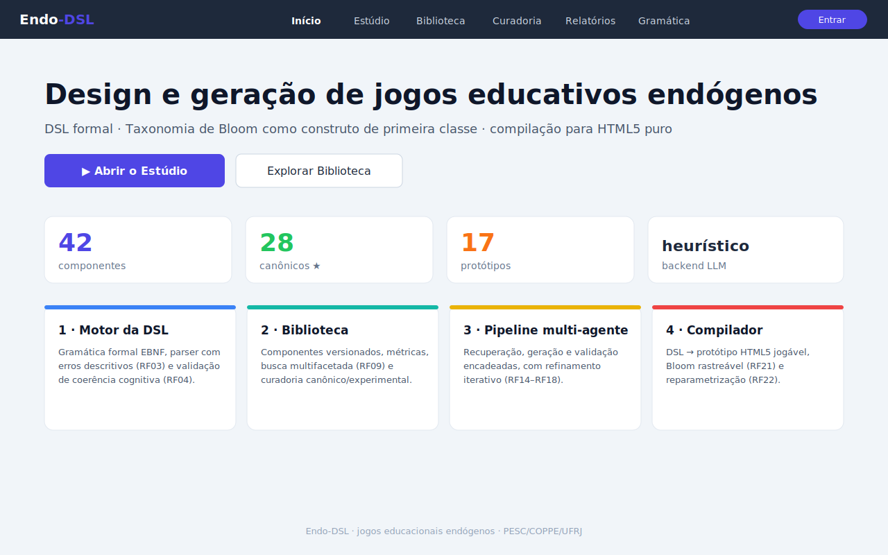
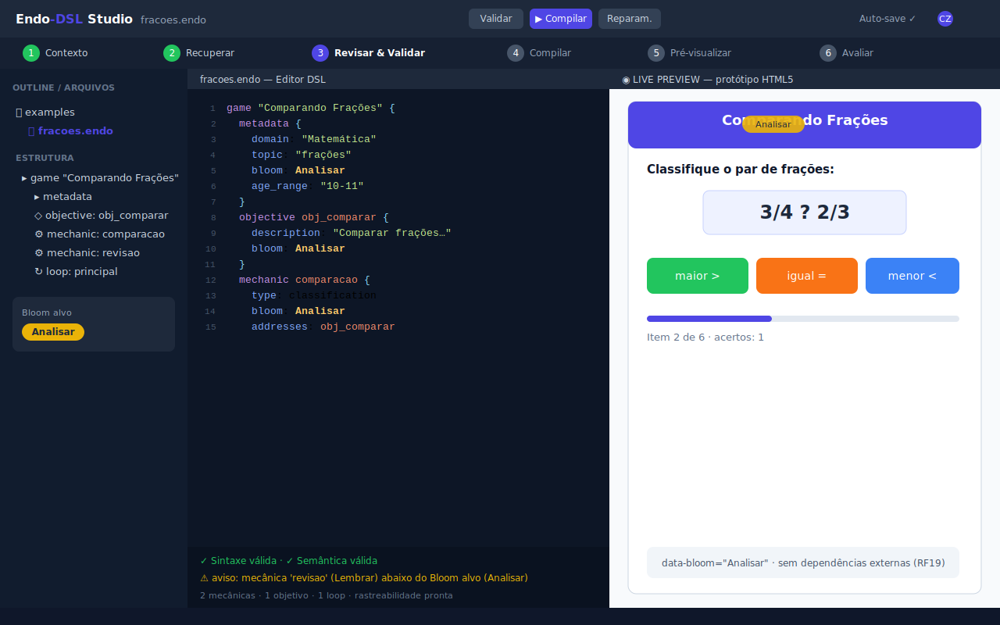
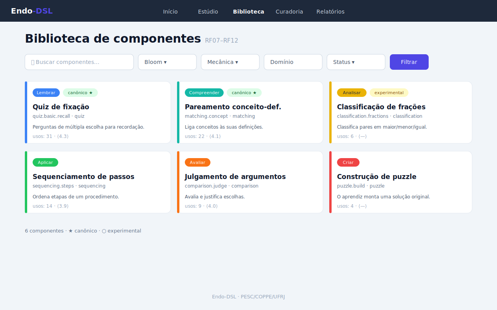
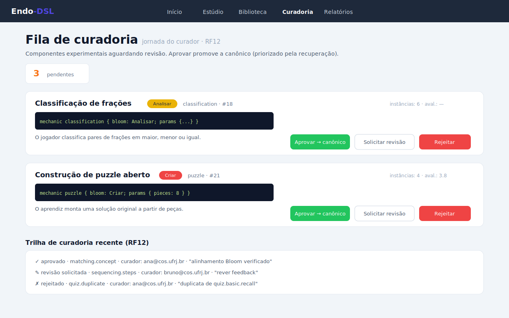
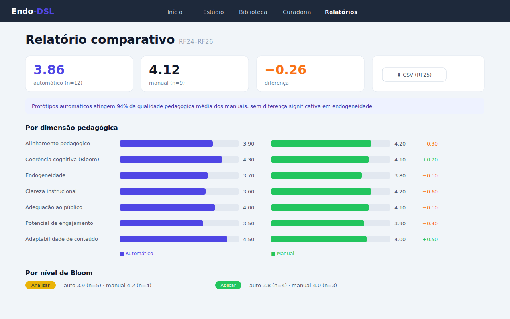
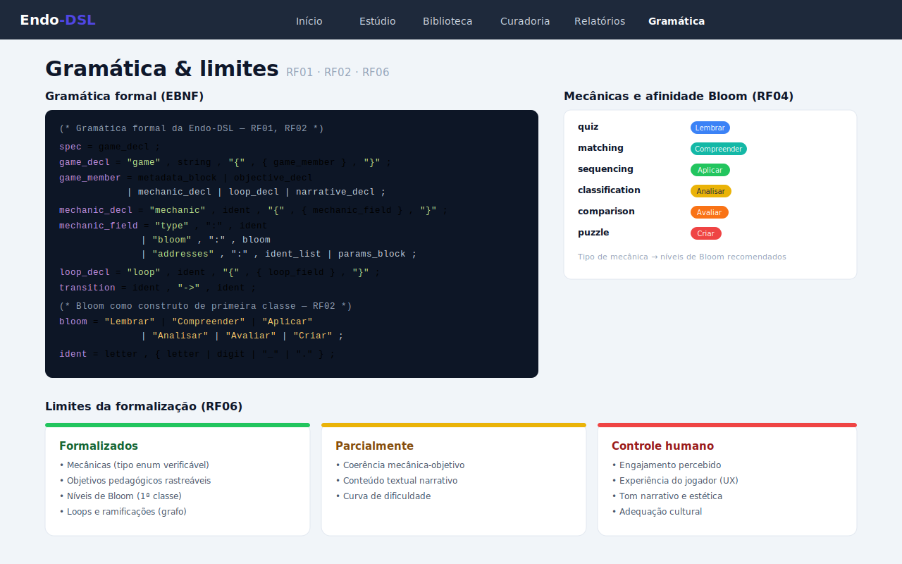
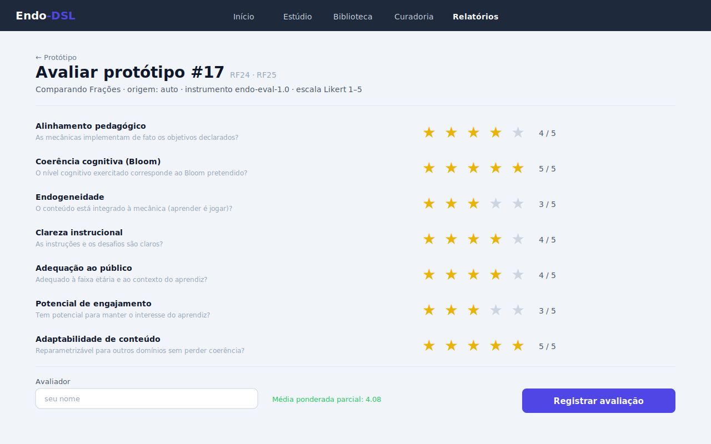

# Manual de Utilização — Interface Web Endo-DSL

> **Guia completo da interface web da plataforma Endo-DSL**, desenvolvida no PESC/COPPE/UFRJ.
> Destina-se a professores, designers instrucionais, pesquisadores, curadores de conteúdo
> e administradores de sistemas que utilizarão a plataforma para criar, validar, compilar
> e avaliar jogos educativos endógenos fundamentados na Taxonomia Revisada de Bloom.

---

## Sumário

1. [Introdução](#1-introdução)
2. [Como iniciar o servidor](#2-como-iniciar-o-servidor)
3. [Histórias de usuário](#3-histórias-de-usuário)
4. [As oito telas principais](#4-as-oito-telas-principais)
   - 4.1 [Home — Dashboard](#41-home--dashboard)
   - 4.2 [Studio — Editor de Design](#42-studio--editor-de-design)
   - 4.3 [Biblioteca de Componentes](#43-biblioteca-de-componentes)
   - 4.4 [Detalhe de Componente](#44-detalhe-de-componente)
   - 4.5 [Fila de Curadoria](#45-fila-de-curadoria)
   - 4.6 [Relatório Comparativo](#46-relatório-comparativo)
   - 4.7 [Documentação/Gramática](#47-documentaçãogramática)
   - 4.8 [Formulário de Avaliação](#48-formulário-de-avaliação)
5. [O Studio em detalhe — Fases 1 a 6](#5-o-studio-em-detalhe--fases-1-a-6)
6. [Editor de DSL ao vivo](#6-editor-de-dsl-ao-vivo)
7. [Guia de referência da DSL](#7-guia-de-referência-da-dsl)
8. [Perguntas frequentes](#8-perguntas-frequentes)

---

## 1. Introdução

### O que é a Endo-DSL

A **Endo-DSL** é uma plataforma de pesquisa para o design e geração semi-automática de
protótipos de **jogos educativos endógenos** — jogos em que o conteúdo de aprendizagem está
integrado às regras de jogo, não apenas justaposto como decoração. A plataforma é composta de:

- Uma **linguagem de domínio específico (DSL)** textual com gramática EBNF formal, onde a
  Taxonomia Revisada de Bloom é um construto de primeira classe verificável.
- Uma **biblioteca de componentes pedagógicos** versionados, curados e reutilizáveis.
- Um **pipeline multi-agente** de recuperação, geração e validação de especificações DSL.
- Um **compilador** DSL → HTML5 autocontido (zero dependências externas em runtime).
- Um **instrumento de avaliação multidimensional** para comparar protótipos automáticos e
  manuais em sete dimensões pedagógicas.

### Para quem se destina

A interface web é projetada para múltiplos perfis de usuário:

| Perfil | Principal caso de uso |
|--------|----------------------|
| Professor do EF/EM | Criar jogos sem programar, via Studio guiado de 6 fases |
| Designer instrucional | Garantir alinhamento cognitivo Bloom×mecânica |
| Pesquisador | Comparar protótipos automáticos vs. manuais |
| Curador de biblioteca | Revisar e promover componentes experimentais |
| Administrador | Monitorar a plataforma e gerenciar o banco de dados |
| Aluno-avaliador | Jogar protótipos e registrar avaliações |
| Desenvolvedor | Contribuir novos componentes e consultar a gramática |

### Princípio de endogeneidade

O princípio central da plataforma é que **aprender é jogar**: o conteúdo educativo deve
emergir da própria mecânica do jogo, não ser adicionado como texto externo. Um aluno que
joga "Comparando Frações" compara frações *porque a mecânica de jogo exige*, não porque
existe um texto instrucional colado ao lado.

---

## 2. Como iniciar o servidor

### Instalação e primeira execução

```bash
# 1. Clone o repositório
git clone https://github.com/caiosazeredo/Endo-DSL.git
cd Endo-DSL

# 2. Crie e ative o ambiente virtual
python3 -m venv .venv
source .venv/bin/activate        # Linux/macOS
# .venv\Scripts\activate         # Windows

# 3. Instale o pacote
pip install -e .

# 4. (Opcional) Suporte ao backend Claude (LLM)
pip install -e ".[llm]"
export ANTHROPIC_API_KEY="sk-ant-api03-…"
```

### Inicializar e servir

```bash
# Inicializar o banco de dados (idempotente)
endo-dsl init-db

# Popular a biblioteca de componentes canônicos
endo-dsl seed-components

# Iniciar o servidor web
endo-dsl serve --host 127.0.0.1 --port 8000
```

Acesse **http://localhost:8000** no navegador. O servidor usa stdlib Python pura — nenhum
serviço externo, nenhuma porta adicional.

### Iniciar com um banco de experimento isolado

```bash
endo-dsl --db /tmp/experimento_A.sqlite3 serve --port 9001
```

Isso mantém bancos separados para cada experimento ou sessão de pesquisa.

### Verificar a saúde do ambiente

```bash
endo-dsl doctor
```

---

## 3. Histórias de usuário

As histórias de usuário a seguir descrevem os principais cenários de uso e especificam,
para cada um, os **critérios de aceitação** e as **telas/funcionalidades** que os satisfazem.

---

### HU-01 — Professor do Ensino Fundamental

> **Como** professor do 5º ano do Ensino Fundamental, **quero** gerar rapidamente um jogo
> interativo sobre frações equivalentes alinhado ao currículo da BNCC, **para** usar em uma
> aula de 15 minutos sem necessidade de conhecimento de programação.

**Critérios de aceitação:**

| # | Critério | Como verificar |
|---|----------|----------------|
| CA1 | Consigo preencher o contexto educacional (domínio, objetivo, Bloom, faixa etária, duração) em um formulário simples | Formulário da Fase 1 no Studio |
| CA2 | A plataforma sugere componentes pedagógicos afins automaticamente | Painel de componentes recuperados na Fase 2 |
| CA3 | Obtenho um protótipo HTML5 jogável sem escrever código | Botão "Compilar" na Fase 5; prévia ao vivo à direita |
| CA4 | Consigo editar o texto da DSL gerada com ajuda visual (cores) e ver erros imediatamente | Editor com realce de sintaxe na Fase 4; barra de status |
| CA5 | Abro o jogo no navegador sem instalar nada adicional | Arquivo `prototype.html` autocontido; link impresso pelo compilador |

**Telas:** Studio (Fases 1–5) → Protótipo  
**CLI equivalente:** `endo-dsl generate --compile`, `endo-dsl compile`

---

### HU-02 — Designer Instrucional

> **Como** designer instrucional de uma secretaria de educação, **quero** garantir que as
> mecânicas de jogo escolhidas exercitem exatamente o nível cognitivo de Bloom pretendido,
> **para** assegurar coerência pedagógica entre objetivos de aprendizagem e atividades.

**Critérios de aceitação:**

| # | Critério | Como verificar |
|---|----------|----------------|
| CA1 | O editor sinaliza visualmente avisos quando a mecânica declarada é incongruente com o Bloom alvo | Barra de status com indicador semântico ativo; mensagem de aviso |
| CA2 | Consigo consultar a tabela de afinidade mecânica×Bloom em uma tela dedicada | Tela de Gramática e Limites; tabela "Tipos de mecânica e afinidade cognitiva" |
| CA3 | A rastreabilidade do protótipo mostra o mapeamento objetivo→mecânica→Bloom | Página `/prototype/<id>/traceability` |
| CA4 | Recebo sugestões de mecânicas alternativas quando a escolhida não é afim ao Bloom | Mensagem de aviso com sugestão no validador |
| CA5 | Posso exportar o relatório de avaliação por dimensão para incluir em dossiê técnico | Tela de Relatórios; botão CSV |

**Telas:** Studio (Fase 4) → Gramática → Relatórios  
**CLI equivalente:** `endo-dsl validate`, `endo-dsl grammar`, `endo-dsl limits`

---

### HU-03 — Pesquisador de Jogos Educativos

> **Como** pesquisador doutorando no PESC/COPPE/UFRJ, **quero** comparar protótipos gerados
> automaticamente com protótipos produzidos manualmente usando o mesmo instrumento de
> avaliação padronizado, **para** sustentar afirmações empíricas sobre a qualidade da geração
> automática na tese de doutorado.

**Critérios de aceitação:**

| # | Critério | Como verificar |
|---|----------|----------------|
| CA1 | Ambos os tipos de protótipo (auto e manual) podem ser avaliados pelo mesmo formulário de 7 dimensões Likert | Formulário de Avaliação, campo `origin` diferencia auto/manual |
| CA2 | O relatório comparativo mostra médias e deltas por dimensão, por Bloom e por domínio | Tela de Relatórios com tabela e gráfico de barras |
| CA3 | Consigo exportar todos os dados brutos em CSV para análise em R/Python | Botão "CSV" na tela de Relatórios |
| CA4 | Os dados de rastreabilidade mostram quais componentes foram usados em cada protótipo | Página de rastreabilidade do protótipo |
| CA5 | Posso isolar experimentos em bancos distintos para controle | Flag `--db` ao iniciar o servidor ou nos comandos CLI |

**Telas:** Avaliação → Relatórios  
**CLI equivalente:** `endo-dsl report`, `endo-dsl report --csv`

---

### HU-04 — Curador da Biblioteca

> **Como** curador da biblioteca de componentes do projeto Endo-DSL, **quero** revisar
> os componentes experimentais submetidos por outros pesquisadores e promovê-los ao status
> canônico quando adequados, **para** elevar a qualidade média do catálogo e garantir que
> os melhores componentes sejam priorizados pelo pipeline de geração.

**Critérios de aceitação:**

| # | Critério | Como verificar |
|---|----------|----------------|
| CA1 | Vejo a fila de componentes experimentais com métricas de uso e avaliação | Tela de Curadoria com cards e indicadores |
| CA2 | Posso aprovar, solicitar revisão ou rejeitar, e a ação fica registrada com meu nome e justificativa | Botões de ação nos cards; trilha de curadoria na página do componente |
| CA3 | Componentes aprovados passam a ser priorizados pelo Agente de Recuperação | Comportamento do pipeline; campo `status` = `canonical` |
| CA4 | Consigo inspecionar a assinatura DSL de cada componente antes de decidir | Pré-visualização no card da curadoria e página de detalhe |
| CA5 | A trilha auditável mostra toda a história de curadoria de cada componente | Seção "Trilha de curadoria" na página de detalhe do componente |

**Telas:** Curadoria → Detalhe de Componente  
**CLI equivalente:** `endo-dsl curate list/approve/reject`

---

### HU-05 — Aluno Avaliador

> **Como** aluno participante de um estudo de pesquisa, **quero** jogar o protótipo de jogo
> educativo e registrar minha avaliação de forma simples, **para** contribuir com dados
> válidos para a pesquisa sem precisar entender a plataforma técnica.

**Critérios de aceitação:**

| # | Critério | Como verificar |
|---|----------|----------------|
| CA1 | O jogo carrega direto no navegador, sem login, sem instalação | Arquivo HTML5 autocontido; rota `/prototype/<id>` |
| CA2 | O formulário de avaliação é simples (cliques em números 1–5) e tem labels claros | Formulário de Avaliação com botões Likert por dimensão |
| CA3 | Posso escrever um comentário livre além das notas numéricas | Campo "Comentários" no formulário |
| CA4 | Minha avaliação é registrada e confirmada visualmente | Mensagem de confirmação após enviar |
| CA5 | Não preciso de conta ou autenticação | Formulário público |

**Telas:** Protótipo → Formulário de Avaliação  
**CLI equivalente:** —

---

### HU-06 — Coordenador Pedagógico

> **Como** coordenador pedagógico de uma instituição de ensino, **quero** ter uma visão
> consolidada da produção de jogos educativos da equipe e da qualidade dos protótipos,
> **para** tomar decisões sobre adoção e desenvolvimento futuro.

**Critérios de aceitação:**

| # | Critério | Como verificar |
|---|----------|----------------|
| CA1 | Vejo indicadores de uso da plataforma no dashboard inicial (componentes, protótipos, backend ativo) | Dashboard da Home com 4 indicadores |
| CA2 | Acesso o relatório comparativo por domínio para entender a qualidade por área curricular | Seção "Por domínio" no Relatório Comparativo |
| CA3 | Consigo exportar os dados para um relatório institucional | CSV do relatório; exportação JSON da biblioteca |
| CA4 | Vejo a distribuição de protótipos por nível de Bloom | Seção "Por nível de Bloom" no Relatório |
| CA5 | Consigo verificar métricas de uso detalhadas via CLI | `endo-dsl stats` |

**Telas:** Home → Relatórios  
**CLI equivalente:** `endo-dsl stats`, `endo-dsl report`

---

### HU-07 — Desenvolvedor Contribuindo Componentes

> **Como** desenvolvedor/pesquisador que quer ampliar o repertório da biblioteca, **quero**
> submeter um novo componente pedagógico experimental com assinatura DSL, parâmetros e
> referências bibliográficas, **para** que ele possa ser usado por outros designers e
> eventualmente promovido a canônico.

**Critérios de aceitação:**

| # | Critério | Como verificar |
|---|----------|----------------|
| CA1 | Consigo criar um componente via API com todos os metadados necessários | Endpoint `POST /api/contribute` ou `platform.contribute_component()` |
| CA2 | O componente aparece como experimental na fila de curadoria | Tela de Curadoria após submissão |
| CA3 | Consigo acompanhar versões e métricas de uso do componente | Seção "Histórico de versões" e "Métricas" na página de detalhe |
| CA4 | A assinatura DSL do componente fica acessível para inspeção | Bloco `<pre>` na página de detalhe |
| CA5 | As referências bibliográficas associadas ao componente são exibidas e exportadas | Seção "Referências" na página de detalhe |

**Telas:** Biblioteca → Detalhe de Componente → Curadoria  
**CLI equivalente:** `endo-dsl library show`, `endo-dsl export`

---

### HU-08 — Administrador do Sistema

> **Como** administrador de sistema do laboratório, **quero** inicializar, monitorar e
> manter a plataforma Endo-DSL em bom estado, **para** que pesquisadores e professores
> possam utilizá-la sem interrupções.

**Critérios de aceitação:**

| # | Critério | Como verificar |
|---|----------|----------------|
| CA1 | Consigo inicializar o banco e popular a biblioteca com um único comando | `endo-dsl init-db && endo-dsl seed-components` |
| CA2 | Posso isolar experimentos em bancos distintos via flag `--db` | Flag global `--db` em todos os comandos |
| CA3 | O diagnóstico `doctor` identifica problemas de configuração | `endo-dsl doctor` lista status OK/WARN/FAIL |
| CA4 | Consigo fazer backup e restaurar a biblioteca facilmente | `endo-dsl export` / `endo-dsl import` |
| CA5 | O servidor é iniciado sem instalar serviços externos | `endo-dsl serve` usa stdlib Python pura |

**Telas:** — (principalmente CLI)  
**CLI equivalente:** `endo-dsl init-db`, `endo-dsl seed-components`, `endo-dsl doctor`, `endo-dsl stats`

---

### HU-09 — Especialista em Taxonomia de Bloom

> **Como** especialista em design instrucional com foco na Taxonomia de Bloom, **quero**
> verificar se as mecânicas de jogo propostas têm afinidade cognitiva comprovada com os
> níveis de Bloom associados, **para** validar a coerência pedagógica da especificação
> antes da compilação.

**Critérios de aceitação:**

| # | Critério | Como verificar |
|---|----------|----------------|
| CA1 | Consigo consultar a tabela completa de afinidade mecânica×Bloom com os seis níveis | Tela de Gramática, seção "Tipos de mecânica e afinidade cognitiva" |
| CA2 | O editor exibe cada elemento com a cor correspondente ao nível de Bloom | Realce de sintaxe no editor do Studio |
| CA3 | A validação semântica sinaliza mecanicamente quando há discordância de Bloom | Barra de status com indicador de semântica |
| CA4 | Os limites da formalização explicam por que alguns aspectos ficam ao critério humano | Tela de Gramática, seção "Limites" com três grupos |
| CA5 | A rastreabilidade do protótipo mapeia cada objetivo ao seu nível e à mecânica correspondente | Página `/prototype/<id>/traceability` |

**Telas:** Gramática → Studio (Fase 4)  
**CLI equivalente:** `endo-dsl grammar`, `endo-dsl limits`, `endo-dsl validate`

---

### HU-10 — Autor de Material Didático Digital

> **Como** autor de livros e materiais didáticos digitais para editora educacional, **quero**
> reutilizar um mesmo protótipo de jogo em múltiplas disciplinas mudando apenas o conteúdo,
> **para** reduzir o tempo de produção de material interativo e manter a qualidade pedagógica.

**Critérios de aceitação:**

| # | Critério | Como verificar |
|---|----------|----------------|
| CA1 | Consigo trocar o domínio de um protótipo compilado sem recompilar toda a estrutura | Botão "Reparametrizar" no Studio; comando `reparametrize` |
| CA2 | A estrutura (mecânicas, loops, Bloom) é preservada na reparametrização | Arquivo `prototype.reparam.html` gerado com mesmo fluxo |
| CA3 | Consigo exportar o protótipo como HTML5 autocontido para incorporar em e-books | Download do HTML pelo botão "Baixar" (Ctrl+S) no Studio |
| CA4 | O instrumento de avaliação pode ser aplicado aos protótipos reparametrizados também | Rota `/evaluate/<id>` funciona para qualquer protótipo |
| CA5 | Os dados de Bloom e rastreabilidade são preservados após reparametrização | Verificar `/prototype/<id>/traceability` do protótipo reparametrizado |

**Telas:** Studio → Protótipo → Avaliação  
**CLI equivalente:** `endo-dsl reparametrize`, `endo-dsl compile`

---

## 4. As oito telas principais

### 4.1 Home — Dashboard



**Propósito:** Porta de entrada da plataforma. Apresenta a proposta central do sistema,
indicadores de uso em tempo real e atalhos para os principais subsistemas.

**Quando usar:** Ao abrir a interface pela primeira vez, para verificar o estado geral da
plataforma e para navegar rapidamente para o Studio ou a Biblioteca.

**O que você vê:**

1. **Barra de navegação superior** com links para todas as telas (Início, Estúdio, Biblioteca,
   Curadoria, Relatórios, Gramática) e botões de tema (◐) e ajuda (?).
2. **Seção hero** com título, subtítulo e dois botões de ação principais: "▶ Abrir o Estúdio
   de Design" e "Explorar a Biblioteca".
3. **Quatro indicadores de uso** em destaque: total de componentes, componentes canônicos,
   protótipos compilados, backend LLM ativo.
4. **Quatro cards de subsistemas** com descrição resumida de cada módulo e os requisitos
   funcionais que cada um atende.
5. **Rodapé** com identificação da instituição (PESC/COPPE/UFRJ).

**Passo a passo:**

1. Verifique se o indicador "backend LLM" mostra `claude` ou `template`. Se mostrar `template`
   e você quiser usar IA generativa, configure `ANTHROPIC_API_KEY` e reinicie o servidor.
2. Se for a primeira execução, o número de "componentes" deve ser 14 (após `seed-components`).
   Se for 0, execute `endo-dsl seed-components` no terminal.
3. Clique em **"▶ Abrir o Estúdio de Design"** para iniciar um novo projeto.

**Dica:** O indicador de backend não é apenas cosmético — ele determina a qualidade da geração
automática na Fase 3 do Studio. O backend `claude` produz DSL mais contextualizada; o
`template` é determinístico e offline.

**Erros comuns:**

- **"componentes: 0"** → Execute `endo-dsl seed-components` para popular a biblioteca.
- **"backend LLM: template" quando esperava "claude"** → Verifique se `ANTHROPIC_API_KEY`
  está definido e se o pacote `anthropic` está instalado (`pip install anthropic`).

---

### 4.2 Studio — Editor de Design



**Propósito:** Coração da plataforma. Ambiente de autoria com layout tipo Overleaf em três
colunas: painel de contexto à esquerda, editor DSL com realce de sintaxe ao centro, e
prévia ao vivo do protótipo à direita. Um *stepper* de 6 fases guia o usuário de forma
progressiva.

**Quando usar:** Para criar qualquer protótipo de jogo, seja pelo pipeline automático (preencher
contexto → gerar DSL → compilar) ou manualmente (escrever DSL direto → compilar).

**Layout em três colunas:**

| Coluna | Conteúdo |
|--------|----------|
| Esquerda (sidebar) | Stepper de fases, formulário de contexto, componentes recuperados, métricas |
| Centro | Toolbar, editor DSL com gutter e realce, barra de status (sintaxe, semântica, avisos) |
| Direita (preview) | Prévia ao vivo do protótipo compilado em `<iframe>` |

**Passo a passo básico (fluxo automático):**

1. Preencha o **formulário de contexto** na coluna esquerda (domínio, tópico, objetivo, Bloom,
   faixa etária, duração).
2. Clique **"Recuperar componentes →"** — a coluna esquerda mostra os componentes afins.
3. Clique **"Gerar especificação →"** — o editor central é preenchido com a DSL gerada.
4. Revise a DSL no editor; a barra de status atualiza em tempo real.
5. Clique **"▶ Recompilar"** na toolbar (ou pressione `Ctrl+Enter`).
6. A prévia à direita mostra o jogo; clique em **"★ Avaliar"** para abrir o formulário.

**Toolbar — botões e atalhos:**

| Botão/Atalho | Ação |
|---|---|
| **▶ Recompilar** / `Ctrl+Enter` | Compila a DSL atual e atualiza a prévia |
| **✨ Gerar com IA** | Roda o pipeline de geração com o contexto atual |
| **⊞ Recuperar componentes** | Busca componentes afins sem gerar |
| **↻ Reparametrizar** | Troca o domínio do protótipo sem recompilar |
| **⬇ Baixar** / `Ctrl+S` | Baixa o HTML5 do protótipo para o computador |
| **★ Avaliar** | Abre o formulário de avaliação do protótipo atual |
| **☰** | Recolhe/expande o painel lateral |
| **⤢** | Abre o protótipo em nova aba |
| **?** | Abre o modal de atalhos de teclado |

**Dicas:**

- Clique em qualquer fase do stepper para navegar sem perder o trabalho no editor.
- O `<iframe>` de prévia atualiza automaticamente após cada compilação bem-sucedida.
- Arraste a borda entre as colunas para redimensioná-las conforme sua tela.
- O campo "Domínio…" no toolbar mais o botão "Reparametrizar" permitem trocar o domínio
  do protótipo já compilado — muito útil para reaproveitar a estrutura pedagógica.

**Erros comuns:**

- **Prévia não atualiza** → Verifique se a compilação foi bem-sucedida (barra de status deve
  mostrar ✓ em sintaxe e semântica).
- **"Gerar com IA" não produz resultado coerente** → Certifique-se de que o objetivo de
  aprendizagem está descrito com clareza e que o nível de Bloom está coerente com o domínio.
- **Sidebar desapareceu** → Clique no botão ☰ na toolbar.

---

### 4.3 Biblioteca de Componentes



**Propósito:** Catálogo navegável de todos os componentes pedagógicos reutilizáveis da
plataforma, com filtros multifacetados e visualização por cards coloridos com nível de Bloom.

**Quando usar:** Para explorar o repertório de mecânicas disponíveis, encontrar componentes
adequados para um domínio/Bloom específico, ou verificar a maturidade (métricas) de um
componente antes de usá-lo.

**Elementos da tela:**

1. **Chips de filtro rápido por Bloom** no topo, com a cor de cada nível. Clique em um chip
   para filtrar imediatamente todos os componentes daquele nível.
2. **Formulário de filtro avançado** com campos: busca textual, seletor de Bloom, seletor de
   mecânica, campo de domínio, seletor de status (canônico/experimental). Botão "Filtrar"
   aplica todos os filtros combinados.
3. **Grade de cards de componentes**, cada card mostrando: nome, chave, badges (Bloom,
   mecânica, domínio), status (★ canônico / experimental), descrição (primeiros 120 chars),
   e métricas (usos, avaliação média, número de avaliações).
4. **Contagem de resultados** acima da grade.

**Passo a passo:**

1. Use os **chips de Bloom** para filtrar rapidamente por nível cognitivo.
2. Combine com o **seletor de mecânica** para encontrar combinações específicas (ex.: Bloom
   Analisar + mecânica comparison).
3. Verifique as **métricas**: componentes com mais instâncias e avaliação média ≥4.0 são
   candidatos sólidos.
4. Clique em um card para abrir a **página de detalhe** do componente.

**Dicas:**

- Componentes **★ canônicos** são priorizados pelo pipeline de geração automática.
- O número de **usos** indica quantas vezes o componente foi instanciado em especificações;
  mais usos = mais testado em produção.
- Use a busca textual com palavras do domínio (ex.: "fração", "célula") para encontrar
  componentes com contexto similar ao seu.

**Erros comuns:**

- **Biblioteca vazia** → Execute `endo-dsl seed-components` para popular com os canônicos.
- **Filtro não retorna resultados** → Tente remover filtros combinados; o banco pode não ter
  componentes que atendam a todos os critérios simultaneamente.

---

### 4.4 Detalhe de Componente

**Propósito:** Exibe todos os metadados de um componente específico, incluindo assinatura DSL,
descrição, parâmetros configuráveis, referências bibliográficas, histórico de versões e
trilha de curadoria.

**Quando usar:** Para inspecionar um componente antes de usá-lo, para acompanhar o histórico
de um componente que você submeteu, ou para verificar as referências pedagógicas que o
fundamentam.

**Seções da página:**

| Seção | Conteúdo |
|-------|----------|
| Cabeçalho | Nome, chave, versão, autor, badges de Bloom e status |
| Assinatura DSL | Bloco de código com a estrutura DSL do componente |
| Descrição | Texto descritivo da mecânica |
| Parâmetros | Lista de chave→valor configuráveis |
| Referências (RF08) | Referências bibliográficas que fundamentam o componente |
| Card lateral | Classificação (Bloom, tipo, domínio, contexto, faixa etária) e métricas (RF11) |
| Histórico de versões | Tabela com versão, nota de mudança, data (RF10) |
| Trilha de curadoria | Tabela com ação, curador, justificativa (RF12) |

**Passo a passo:**

1. Na seção **Assinatura DSL**, leia a estrutura do componente para entender o que será
   gerado ao usá-lo.
2. Na seção **Parâmetros**, verifique quais aspectos são configuráveis (ex.: número de
   questões, dificuldade).
3. Consulte as **Referências** para verificar a base pedagógica — componentes canônicos
   devem ter referências de qualidade.
4. Verifique a **Trilha de curadoria** para entender as decisões históricas sobre o componente.

**Dicas:**

- A taxa de sucesso de compilação nas métricas (RF11) indica a confiabilidade técnica do
  componente. Abaixo de 80% é sinal de alerta.
- A navegação "← Biblioteca" no topo leva de volta à lista com os filtros preservados.

---

### 4.5 Fila de Curadoria



**Propósito:** Painel de revisão para curadores de biblioteca. Exibe todos os componentes
experimentais que aguardam aprovação ou rejeição, com ações auditáveis.

**Quando usar:** Quando você é designado como curador e recebe notificação de novos
componentes experimentais para revisão, ou periodicamente para manter o catálogo atualizado.

**Elementos da tela:**

1. **Cards de componentes experimentais** na fila, cada um mostrando: nome, badges de Bloom
   e tipo, métricas de uso e avaliação, assinatura DSL, descrição.
2. **Três botões de ação** em cada card:
   - **"Aprovar (→ canônico)"** — promove o componente ao status `canonical`
   - **"Solicitar revisão"** — solicita ao autor ajustes antes de aprovar
   - **"Rejeitar"** — muda para `rejected` e registra motivo
3. **Modal de confirmação** (nos botões de ação) solicitando curador e justificativa.

**Passo a passo:**

1. Leia a **assinatura DSL** de cada componente: verifique se o tipo de mecânica declarado
   é coerente com o nível de Bloom.
2. Consulte as **métricas**: componentes com muitas instâncias e boa avaliação são candidatos
   mais confiáveis a canônico.
3. Compare a mecânica com a tabela de afinidade na tela de Gramática (se necessário, abra
   `/docs` em outra aba).
4. Clique **"Aprovar"** ou **"Rejeitar"** e preencha o modal com seu nome e justificativa.

**Critérios recomendados para aprovação:**

- O tipo de mecânica tem afinidade com o nível de Bloom declarado.
- A descrição explica claramente como o conteúdo é integrado à mecânica (endogeneidade).
- Parâmetros estão documentados e têm valores default razoáveis.
- Há pelo menos uma referência bibliográfica ou ao menos uma instância validada.

**Dicas:**

- A trilha de curadoria é imutável após registrada — registre justificativas claras.
- O botão "Solicitar revisão" não altera o status para `rejected`; o componente continua
  experimental e pode ser resubmetido.

---

### 4.6 Relatório Comparativo



**Propósito:** Painel analítico para comparar protótipos gerados automaticamente versus
produzidos manualmente, nas sete dimensões do instrumento `endo-eval-1.0`.

**Quando usar:** Para analisar resultados de experimentos de pesquisa, para apresentar
dados a comitês acadêmicos ou para tomar decisões de melhoria na plataforma.

**Seções do relatório:**

1. **Quatro indicadores** de topo: média geral auto (com n), média geral manual (com n),
   delta (auto−manual), e botão de exportação CSV.
2. **Callout de interpretação** gerado automaticamente pelo módulo `evaluation/reports.py`.
3. **Gráfico de barras comparativo** por dimensão, com cor índigo para automático e verde
   para manual.
4. **Tabela de dimensões** com médias auto, manual e delta para cada uma das 7 dimensões.
5. **Tabela por nível de Bloom** com médias e contagens por nível.
6. **Tabela por domínio** com médias e contagens por área de conhecimento.

**Passo a passo:**

1. Verifique o **delta geral** no indicador: se for próximo de zero (ex.: −0.30), os
   protótipos automáticos aproximam-se da qualidade manual.
2. Leia o **callout de interpretação** — ele sintetiza as diferenças mais relevantes.
3. Examine o **gráfico de barras** para identificar dimensões com maior discrepância.
4. Consulte a **tabela por dimensão** para detalhes numéricos precisos.
5. Clique **"⬇ CSV (RF25)"** para exportar para análise estatística em R/Python.

**Dicas:**

- Para uma análise válida, você precisa de pelo menos 5 avaliações em cada grupo (auto/manual).
  Com menos dados, o relatório exibe "—" nas células sem dados.
- A endogeneidade (uma das 7 dimensões) tem peso 1.3 na média ponderada — é o critério mais
  importante no contexto desta pesquisa.

---

### 4.7 Documentação/Gramática



**Propósito:** Documentação viva e interativa da Endo-DSL: gramática EBNF formal, tabela de
mecânicas com afinidade cognitiva, e os limites formais da gramática.

**Quando usar:** Como referência ao escrever DSL manualmente, para verificar quais mecânicas
são afins a qual nível de Bloom, ou para entender os fundamentos teóricos das limitações
da formalização.

**Seções:**

1. **Gramática formal (EBNF)** — bloco de código com a gramática completa renderizada diretamente
   do arquivo `grammar.ebnf`.
2. **Tabela de tipos de mecânica e afinidade cognitiva (RF04)** — lista todos os tipos de
   mecânica disponíveis com seu rótulo e os níveis de Bloom com os quais têm afinidade.
3. **Limites da formalização (RF06)** — três grupos de cards:
   - **Verde (Formalizados):** construtos verificáveis pela gramática
   - **Amarelo (Parcialmente formalizados):** estrutura sim, qualidade não
   - **Vermelho (Controle humano deliberado):** dependem de julgamento humano

**Passo a passo:**

1. Para escrever uma mecânica, consulte a **tabela de afinidade** para escolher um tipo
   compatível com o nível de Bloom do seu objetivo.
2. Consulte a **gramática EBNF** para a sintaxe exata de cada construto.
3. Antes de criticar o que o validador "não verifica", leia os **Limites** — eles explicam
   deliberadamente por que certos aspectos ficam ao controle humano (ex.: engajamento,
   tom narrativo, adequação cultural).

**Tabela de afinidade — resumo:**

| Tipo de mecânica | Níveis de Bloom afins |
|---|---|
| quiz | Lembrar, Compreender |
| matching | Lembrar, Compreender |
| classification | Compreender, Analisar |
| comparison | Analisar |
| sorting | Analisar, Aplicar |
| sequencing | Aplicar, Analisar |
| puzzle | Aplicar, Avaliar, Criar |
| narrative_branch | Avaliar, Criar |

---

### 4.8 Formulário de Avaliação



**Propósito:** Instrumento estruturado de avaliação pedagógica (`endo-eval-1.0`) com sete
dimensões em escala Likert 1–5. Usado para registrar avaliações de protótipos por professores,
pesquisadores e alunos.

**Quando usar:** Após jogar um protótipo (próprio ou produzido por outro) e querer registrar
uma avaliação formal para análise comparativa.

**As sete dimensões de avaliação:**

| Dimensão | Pergunta guia | Peso |
|---|---|---|
| Alinhamento pedagógico | O jogo atende ao objetivo de aprendizagem declarado? | 1.3 |
| Coerência cognitiva (Bloom) | As mecânicas exercitam o nível cognitivo pretendido? | 1.2 |
| Endogeneidade | O conteúdo está integrado à mecânica ou apenas justaposto? | 1.3 |
| Clareza instrucional | As instruções são claras e compreensíveis para o público? | 1.0 |
| Adequação ao público | O jogo é adequado para a faixa etária e escolaridade? | 1.0 |
| Potencial de engajamento | O jogo motiva o aluno a continuar jogando? | 1.0 |
| Adaptabilidade de conteúdo | O design pode ser adaptado a outros contextos/domínios? | 0.8 |

**Passo a passo:**

1. Acesse a rota `/evaluate/<id>` ou clique **"★ Avaliar"** no Studio após compilar.
2. Para cada dimensão, clique no número (1=péssimo, 5=excelente) que melhor representa
   sua avaliação.
3. Informe seu **nome** no campo "Avaliador".
4. Escreva **comentários** relevantes (opcional mas recomendado para análise qualitativa).
5. Clique **"Registrar avaliação"** — uma mensagem de confirmação é exibida.

**Dicas:**

- O mesmo formulário é usado para avaliar protótipos automáticos e manuais — isso garante
  **comparabilidade** no relatório.
- A **endogeneidade** é a dimensão mais específica: avalia se jogar *é* aprender, não se
  jogar *facilita* aprender.
- Se você não se sentir confortável para avaliar uma dimensão (ex.: clareza instrucional
  para um público que não conhece), use nota 3 (neutra) e anote no comentário.

**Erros comuns:**

- **Botão "Registrar avaliação" não funciona** → Verifique se todas as 7 dimensões foram
  preenchidas.
- **Avaliação não aparece no relatório** → O relatório agrega por `origin` (auto/manual);
  verifique se o protótipo foi compilado com o `origin` correto.

---

## 5. O Studio em detalhe — Fases 1 a 6

### Fase 1 — Contexto Educacional (RF13)

**O que acontece:** Você fornece o contexto pedagógico que guiará todo o pipeline.

**Campos do formulário:**

| Campo | Obrigatório | Descrição |
|-------|:-----------:|-----------|
| Tema/área | Recomendado | Área de conhecimento ampla. Ex.: "Matemática", "Ciências", "História" |
| Tópico específico | Opcional | Recorte dentro do domínio. Ex.: "frações equivalentes", "sistemas solares" |
| Objetivo de aprendizagem | Recomendado | O que o aluno deve ser capaz de fazer após o jogo. Use verbos de Bloom |
| Nível de Bloom desejado | Obrigatório | Selecione um dos 6 níveis no seletor |
| Faixa etária | Opcional | Intervalo de anos. Ex.: "10-11", "12-14" |
| Duração (min) | Opcional | Tempo total estimado da atividade |
| Escolaridade | Opcional | Série ou ciclo. Ex.: "5º ano", "Ensino Médio" |
| Sem leitura extensiva | Opcional | Marque se o público tiver dificuldade de leitura |

**Bastidores:** Ao clicar "Recuperar componentes →", os dados do formulário são enviados
para `POST /api/session`, que cria uma sessão de design no banco com um `DesignContext` completo.

**Dicas para bons resultados:**

- Escreva o objetivo com **verbos de Bloom** adequados ao nível escolhido (ex.: para
  Analisar, use "comparar", "diferenciar", "organizar").
- Seja específico no tópico — "frações equivalentes" gera resultados mais coerentes do que
  apenas "frações".
- A faixa etária influencia a complexidade dos parâmetros gerados (ex.: número de questões,
  nível de dificuldade).

---

### Fase 2 — Recuperação de Componentes (RF14)

**O que acontece:** O Agente de Recuperação busca na biblioteca os componentes mais afins ao
contexto fornecido, usando busca por similaridade (bloom, tipo de mecânica, domínio).

**Bastidores:** A chamada `POST /api/retrieve` aciona `platform.retrieve()`, que usa o
`retriever.py` para ranquear componentes por similaridade de Bloom, tipo e domínio. Componentes
canônicos têm prioridade no ranking.

**O que você vê:** Lista de componentes recuperados na sidebar esquerda, cada um com:
- Nome e chave
- Badge de Bloom (colorido)
- Tipo de mecânica
- Avaliação média

**Ações disponíveis:**
- **Selecionar/deselecionar** componentes para usar na geração
- Clicar **"Gerar especificação →"** com os selecionados
- Clicar **"Gerar do zero (IA)"** para ignorar componentes e gerar livremente

**Dicas:**

- Componentes com avaliação alta (⟨4.0⟩ ou mais) são melhores ponto de partida.
- Se nenhum componente parece adequado, use "Gerar do zero" — o LLM criará a estrutura
  sem ancoragem em componentes existentes.
- Você pode selecionar apenas alguns dos recuperados e deselecionar os menos relevantes.

---

### Fase 3 — Geração da Especificação DSL (RF15–RF18)

**O que acontece:** O Agente de Geração produz a especificação DSL usando o contexto (Fase 1)
e os componentes selecionados (Fase 2) como guias. O pipeline valida automaticamente o
resultado e, se inválido, tenta até 3 vezes com refinamento guiado pelos diagnósticos de erro.

**Bastidores:** A chamada `POST /api/generate` aciona `platform.generate()`, que chama
`pipeline.run()`. O backend LLM (template ou Claude) preenche um prompt estruturado com o
contexto e os componentes, e gera a DSL. O validador é invocado em loop até que a DSL
seja válida ou o limite de tentativas seja atingido.

**O que você vê:** O editor central é preenchido com a DSL gerada. A barra de status
atualiza automaticamente com o resultado da validação. A sidebar mostra as métricas de
geração (tentativas, backend, componentes usados).

**Métricas de geração:**

| Métrica | Descrição |
|---------|-----------|
| Tentativas | Quantas gerações foram necessárias (ideal: 1) |
| Backend | `template` ou `claude` |
| Componentes usados | Chaves dos componentes incorporados na DSL |
| Válida | Se a DSL final passou na validação |

**Dicas:**

- Com o backend `template`, a geração é instantânea e determinística. Com `claude`, pode
  levar alguns segundos e tende a produzir DSL mais contextualizada.
- Se a geração falhar após 3 tentativas (barra de status vermelha), simplifique o objetivo
  de aprendizagem ou mude o nível de Bloom.

---

### Fase 4 — Revisão e Validação (RF05) — O ponto de controle humano

**O que acontece:** Você revisa e edita livremente a DSL no editor central. A validação
ocorre em tempo real a cada digitação (debounced). Esta é a fase em que você exerce
**julgamento humano** sobre aspectos que a gramática deliberadamente não verifica: tom
narrativo, estética, adequação cultural, engajamento percebido.

**Bastidores:** O editor chama `POST /api/validate` com a DSL atual a cada 300ms de inatividade
(debounce). O servidor executa `platform.validate()`, que retorna erros e avisos. O JS
atualiza os indicadores da barra de status e exibe as mensagens de diagnóstico abaixo do editor.

**Barra de status:**

| Indicador | Verde | Vermelho |
|---|---|---|
| `sintaxe` | Parse bem-sucedido | Erro de sintaxe |
| `semântica` | Validação semântica OK | Erro semântico (ex.: tipo inválido) |
| `N avisos` | Zero avisos | Um ou mais avisos pedagógicos |

**Atalhos de teclado:**

| Atalho | Ação |
|--------|------|
| `Ctrl+Enter` | Compilar o protótipo imediatamente |
| `Ctrl+S` | Baixar o protótipo HTML5 atual |
| `?` | Abrir o modal de atalhos de teclado |
| `Esc` | Fechar modais |

**O que você pode fazer manualmente na DSL:**

- Alterar a `description` do jogo e dos objetivos
- Ajustar os parâmetros (`params`) das mecânicas
- Adicionar `narrative` blocks para narrativa ramificada
- Reordenar mecânicas no `loop`
- Trocar o tipo de mecânica (respeitando a afinidade de Bloom)

**Dicas:**

- Erros de sintaxe são exibidos com linha e coluna — localize-os facilmente pelo gutter.
- Avisos não impedem a compilação; são sugestões de melhoria pedagógica.
- Esta fase é onde você exerce o "ponto de controle humano" descrito em RF06.

---

### Fase 5 — Compilação do Protótipo (RF19–RF23)

**O que acontece:** A DSL do editor é enviada ao compilador, que gera o protótipo HTML5
autocontido, persiste no banco e atualiza a prévia ao vivo.

**Bastidores:** O botão "▶ Recompilar" (ou `Ctrl+Enter`) chama `POST /api/compile`. O
servidor executa `platform.compile()`, que: (1) parseia a DSL; (2) valida semanticamente;
(3) constrói o *content pack* JSON; (4) renderiza o HTML5 com engine de templates; (5)
gera o documento de rastreabilidade; (6) persiste no banco; (7) grava os arquivos.

**O que você vê:** A coluna direita (prévia) exibe o protótipo jogável em um `<iframe>`. A
mensagem de status no topo da prévia indica o ID do protótipo e a hora da compilação.

**O jogo é HTML5 autocontido:** você pode baixá-lo (`Ctrl+S`) e abri-lo offline, sem
servidor, em qualquer navegador moderno.

**Rastreabilidade (RF23):**
Acesse `/prototype/<id>/traceability` para ver o documento que mapeia:
- Cada objetivo pedagógico → mecânicas que o endereçam → nível de Bloom
- Componentes usados com referências bibliográficas
- Métricas de alinhamento

**Dicas:**

- Se a compilação falhar, os erros aparecem na região de diagnósticos abaixo do editor
  com sugestões da biblioteca (RF20).
- Use o botão **"⤢"** na prévia para abrir o protótipo em uma aba dedicada e testá-lo
  com tela cheia.
- O botão "Reparametrizar" na toolbar permite trocar o domínio sem recompilar — muito útil
  para reutilizar a estrutura em outras disciplinas.

---

### Fase 6 — Avaliação (RF24–RF25)

**O que acontece:** Você (ou um avaliador designado) preenche o instrumento `endo-eval-1.0`
para o protótipo recém-compilado.

**Bastidores:** O botão "★ Avaliar" redireciona para `/evaluate/<id>`. O formulário chama
`POST /api/evaluate` com os scores e metadados. Os dados são persistidos na tabela
`evaluations` do banco e ficam disponíveis no relatório comparativo.

**Dicas:**

- Avalie sempre com honestidade — a comparação auto×manual é o dado central da pesquisa.
- Registre o campo `Avaliador` com seu nome para rastreabilidade.
- Use o campo `Comentários` para capturar observações qualitativas que os números não capturam.

---

## 6. Editor de DSL ao vivo

### Realce de sintaxe

O editor do Studio usa realce de sintaxe com as seguintes convenções de cor:

| Elemento | Cor no editor |
|----------|--------------|
| Palavras-chave (`game`, `mechanic`, `loop`, `objective`, `narrative`, `branch`) | Azul-índigo |
| Nível de Bloom (`Analisar`, `Criar`, etc.) | Cor específica de Bloom (igual ao badge) |
| Strings entre aspas | Verde |
| Identificadores de nomes | Cinza escuro |
| Comentários `//` | Cinza claro |
| Chaves `{ }` e dois-pontos `:` | Preto |
| Tipos de mecânica após `type:` | Laranja |
| Erros de sintaxe | Sublinhado vermelho |

### Gutter de linhas

A coluna esquerda do editor (gutter) exibe os números de linha. Erros e avisos são indicados
por ícones coloridos no gutter à altura da linha problemática. Clique no ícone para ver a
mensagem completa.

### Validação em tempo real

A validação dispara automaticamente após 300ms de inatividade no editor (debounce). Os três
indicadores na barra de status abaixo do editor atualizam em tempo real:

- **ponto verde `sintaxe`** — o parser não encontrou erros
- **ponto verde `semântica`** — a validação semântica passou
- **ponto cinza/laranja `N avisos`** — número de avisos pedagógicos

### Atalhos de teclado completos

| Atalho | Ação |
|--------|------|
| `Ctrl+Enter` | Compilar o protótipo (Fase 5) |
| `Ctrl+S` | Baixar o HTML5 compilado |
| `?` | Abrir/fechar modal de ajuda com atalhos |
| `Esc` | Fechar modais/overlays |
| `Tab` | Inserir indentação (2 espaços por padrão) |

### Contador de cursor

O canto direito da barra de status exibe a posição atual do cursor: `Ln 1, Col 1`. Use
esta informação em conjunto com as mensagens de erro que indicam linha e coluna do problema.

---

## 7. Guia de referência da DSL

### Estrutura geral

Um arquivo `.endo` começa com a declaração `game` e contém quatro tipos de membros: `metadata`,
`objective`, `mechanic`, `loop` e `narrative`. Todos são opcionais exceto `game` em si, mas
uma especificação mínima útil precisa de pelo menos um objetivo, uma mecânica e um loop.

```
game "<título do jogo>" {
  metadata { ... }
  objective <id> { ... }
  mechanic <id> { ... }
  loop <id> { ... }
  narrative <id> { ... }
}
```

### Gramática EBNF completa (anotada)

```ebnf
(* Ponto de entrada: uma especificação é uma declaração de jogo *)
spec            = game_decl ;

(* O jogo tem um título (string) e zero ou mais membros entre chaves *)
game_decl       = "game" , string , "{" , { game_member } , "}" ;

(* Tipos de membros possíveis dentro do jogo *)
game_member     = metadata_block
                | objective_decl
                | mechanic_decl
                | loop_decl
                | narrative_decl ;

(* Bloco de metadados: pares chave:valor com informações do contexto educacional *)
metadata_block  = "metadata" , "{" , { entry } , "}" ;
entry           = ident , ":" , value ;   (* ex.: domain: "Matemática" *)

(* Objetivo pedagógico: nome, descrição e nível de Bloom *)
objective_decl  = "objective" , ident , "{" , { objective_field } , "}" ;
objective_field = "description" , ":" , string
                | "bloom"       , ":" , bloom ;

(* Mecânica de jogo endógena: tipo, Bloom, objetivos que atende, parâmetros *)
mechanic_decl   = "mechanic" , ident , "{" , { mechanic_field } , "}" ;
mechanic_field  = "type"             , ":" , ident
                | "bloom"            , ":" , bloom
                | "addresses"        , ":" , ident_list   (* ids de objectives *)
                | "description"      , ":" , string
                | "source_component" , ":" , string       (* chave de biblioteca *)
                | params_block ;

(* Bloco de parâmetros: pares chave:valor específicos da mecânica *)
params_block    = "params" , "{" , { entry } , "}" ;

(* Loop de jogabilidade: nível Bloom e grafo de transições entre mecânicas *)
loop_decl       = "loop" , ident , "{" , { loop_field } , "}" ;
loop_field      = "bloom"       , ":" , bloom
                | "description"  , ":" , string
                | steps_block ;
steps_block     = "steps" , "{" , { transition } , "}" ;
transition      = ident , "->" , ident ;    (* ex.: m1 -> m2 *)

(* Ramificação narrativa: ramos com texto, escolhas e alvos *)
narrative_decl  = "narrative" , ident , "{" , { branch_decl } , "}" ;
branch_decl     = "branch" , ident , "{" , { branch_field } , "}" ;
branch_field    = "bloom"       , ":" , bloom
                | "text"         , ":" , string
                | "description"  , ":" , string
                | choice_decl ;
choice_decl     = "choice" , string , "->" , ident ;    (* "texto" -> branch_alvo *)

(* Tipos de valor aceitos em pares chave:valor *)
value           = string | number | range | bool | ident ;
range           = number , ".." , number ;   (* ex.: 1..10 *)
bool            = "true" | "false" ;

(* Bloom como construto de primeira classe (RF02) *)
(* O parser também aceita equivalentes em inglês: Remember, Understand, Apply, *)
(* Analyze, Evaluate, Create                                                   *)
bloom           = "Lembrar" | "Compreender" | "Aplicar"
                | "Analisar" | "Avaliar"    | "Criar" ;

(* Terminais léxicos *)
ident           = letter , { letter | digit | "_" | "." } ;
string          = '"' , { character - '"' } , '"' ;
number          = [ "-" ] , digit , { digit } , [ "." , digit , { digit } ] ;
```

**Comentários:** use `//` para comentários de linha ou `/* */` para blocos. Ambos são
ignorados pelo parser.

---

### Construtos em detalhes

#### `metadata` — metadados do contexto educacional

O bloco `metadata` é opcional mas altamente recomendado. Armazena informações contextuais
que o pipeline usa para recuperação e geração.

```
metadata {
  domain:    "Matemática"       // área de conhecimento
  topic:     "frações"          // tópico específico
  bloom:     Analisar           // nível de Bloom principal
  age_range: "10-11"            // faixa etária
  duration:  15                 // duração em minutos (número)
}
```

Campos reconhecidos: `domain`, `topic`, `bloom`, `age_range`, `duration`, `education_level`,
`platform`. Outros campos são armazenados como `extra` e passados ao pipeline.

---

#### `objective` — objetivo pedagógico

Representa um objetivo de aprendizagem verificável. Pode ser referenciado por mecânicas
via `addresses`.

```
objective obj_comparar {
  description: "Comparar frações com denominadores diferentes usando equivalência"
  bloom: Analisar
}
```

**Campos:**

| Campo | Obrigatório | Tipo | Descrição |
|-------|:-----------:|------|-----------|
| `description` | Recomendado | string | Descrição do objetivo em linguagem natural |
| `bloom` | Recomendado | bloom | Nível cognitivo do objetivo |

**Boas práticas:**
- Use verbos de Bloom alinhados ao nível declarado.
- Declare um objetivo por habilidade que o jogo deve desenvolver.
- Todo objetivo deve ser endereçado por pelo menos uma mecânica.

---

#### `mechanic` — mecânica de jogo endógena

O núcleo da especificação. Cada mecânica representa um tipo de interação que o jogador
tem com o conteúdo.

```
mechanic comparacao {
  type: classification          // tipo de mecânica (enum)
  bloom: Analisar               // nível cognitivo da mecânica
  addresses: obj_comparar       // objective(s) que endereça
  description: "O jogador classifica pares de frações em maior, menor ou igual."
  source_component: "classification.fractions"  // componente de biblioteca usado
  params {
    items: 6                    // número de itens na atividade
    feedback: immediate         // tipo de feedback
    difficulty: "medium"        // nível de dificuldade
  }
}
```

**Campos:**

| Campo | Obrigatório | Tipo | Descrição |
|-------|:-----------:|------|-----------|
| `type` | **sim** | ident | Tipo de mecânica. Enum fechado: `quiz`, `classification`, `comparison`, `matching`, `sequencing`, `sorting`, `puzzle`, `narrative_branch` |
| `bloom` | Recomendado | bloom | Nível cognitivo da mecânica. Deve ter afinidade com o `type` |
| `addresses` | Recomendado | ident ou lista | ID(s) de objetivo(s) que esta mecânica endereça |
| `description` | Opcional | string | Descrição em linguagem natural do design da mecânica |
| `source_component` | Opcional | string | Chave do componente de biblioteca que originou esta mecânica |
| `params` | Opcional | bloco | Parâmetros específicos da mecânica |

**Parâmetros comuns (sugeridos):**

| Parâmetro | Tipo | Descrição |
|-----------|------|-----------|
| `items` | número | Número de itens/questões/pares |
| `questions` | número | Número de perguntas (para `quiz`) |
| `attempts` | número | Número máximo de tentativas |
| `feedback` | ident/string | Tipo de feedback: `immediate`, `delayed`, `none` |
| `difficulty` | string | Nível de dificuldade: `"easy"`, `"medium"`, `"hard"` |
| `time_limit` | número | Limite de tempo em segundos |

---

#### `loop` — loop de jogabilidade

Define o fluxo de jogo como um grafo de transições entre mecânicas.

```
loop principal {
  bloom: Analisar
  description: "Classificar e revisar até consolidar a comparação."
  steps {
    comparacao -> revisao    // após comparacao, vai para revisao
    revisao -> comparacao    // após revisao, volta para comparacao
  }
}
```

**Campos:**

| Campo | Descrição |
|-------|-----------|
| `bloom` | Nível cognitivo dominante do loop |
| `description` | Descrição em linguagem natural do fluxo |
| `steps { }` | Grafo de transições no formato `<mecânica_origem> -> <mecânica_destino>` |

**Regras:**
- Os identificadores nas transições devem corresponder a mecânicas declaradas.
- O compilador verifica se há pelo menos uma mecânica alcançável (RF19).
- Loops cíclicos são válidos e comuns (ex.: `m1 -> m2 -> m1`).

---

#### `narrative` — ramificação narrativa

Permite criar histórias interativas com escolhas que ramificam o fluxo.

```
narrative historia_inicial {
  branch introducao {
    bloom: Compreender
    text: "Você encontrou duas frações: 1/2 e 2/4. São iguais?"
    description: "Introdução ao conceito de equivalência"
    choice "Sim, são equivalentes" -> conclusao_correta
    choice "Não, são diferentes" -> revisao_conceito
  }
  branch conclusao_correta {
    bloom: Avaliar
    text: "Correto! 1/2 = 2/4 porque ambas representam a mesma parte."
  }
  branch revisao_conceito {
    bloom: Lembrar
    text: "Vamos rever: frações equivalentes representam a mesma quantidade."
  }
}
```

---

### Exemplo completo e anotado

O arquivo `examples/fracoes.endo` é o exemplo canônico da plataforma:

```
// Exemplo: Comparação de Frações — Bloom: Analisar
// Arquivo: fracoes.endo
// Use: endo-dsl compile examples/fracoes.endo

game "Comparando Frações" {
  // Metadados do contexto educacional (RF13)
  metadata {
    domain: "Matemática"        // área de conhecimento
    topic: "frações"            // tópico específico
    bloom: Analisar             // nível de Bloom principal do jogo
    age_range: "10-11"          // alunos do 5º/6º ano
    duration: 15                // 15 minutos de aula
  }

  // Objetivo principal: o que o aluno deve aprender (RF04)
  objective obj_comparar {
    description: "Comparar frações com denominadores diferentes usando equivalência"
    bloom: Analisar             // verbo: comparar → Analisar
  }

  // Mecânica principal: classificação endógena de frações (RF04)
  mechanic comparacao {
    type: classification        // o aluno classifica → Analisar ✓ (afinidade)
    bloom: Analisar
    addresses: obj_comparar     // esta mecânica endereça o objetivo acima
    description: "O jogador classifica pares de frações em maior, menor ou igual."
    params {
      items: 6                  // 6 pares de frações
      feedback: immediate       // feedback imediato após cada escolha
    }
  }

  // Mecânica secundária: quiz de fixação (nível menor — gera aviso, ok)
  mechanic revisao {
    type: quiz                  // quiz → Lembrar/Compreender
    bloom: Lembrar              // aviso: abaixo do alvo (Analisar), mas válido
    description: "Rodada de revisão para fixação dos conceitos."
    params {
      questions: 4
      attempts: 2
    }
  }

  // Loop: o jogador alterna entre comparação e revisão
  loop principal {
    bloom: Analisar
    description: "Classificar e revisar até consolidar a comparação."
    steps {
      comparacao -> revisao     // após classificar, revisa
      revisao -> comparacao     // após revisar, volta a classificar
    }
  }
}
```

---

### Erros comuns e como corrigir

| Erro | Causa | Solução |
|------|-------|---------|
| `tipo desconhecido 'adventure'` | Tipo de mecânica não existe | Consulte a tabela de tipos na tela Gramática |
| `mecânica 'm1' não declara 'type'` | Campo `type` ausente | Adicione `type: <tipo>` |
| `alvo 'obj_x' não declarado` | `addresses` aponta para objetivo inexistente | Verifique o id do objetivo ou declare-o |
| `alvo de transição 'm3' não declarado` | Transição no loop aponta para mecânica inexistente | Verifique o id da mecânica |
| `bloom inválido 'Analisar_'` | Erro de digitação no nível | Use exatamente: `Lembrar`, `Compreender`, `Aplicar`, `Analisar`, `Avaliar`, `Criar` |
| String não fechada | Aspas não balanceadas | Verifique que toda string aberta com `"` é fechada |
| Chave não fechada | `{` sem `}` correspondente | Use o gutter para contar as chaves |

---

## 8. Perguntas frequentes

**O banco de dados precisa de um servidor?**
Não. A plataforma usa SQLite embutido via stdlib Python — nenhum servidor de banco de dados
é necessário. O arquivo `.sqlite3` fica em `~/.endo/endo_dsl.sqlite3` por padrão.

**Posso usar o jogo gerado offline?**
Sim. O protótipo HTML5 é completamente autocontido — sem CDN, sem APIs externas, sem JavaScript
de terceiros. Funciona offline em qualquer navegador moderno.

**O que acontece se não tiver chave da Anthropic?**
A plataforma usa o backend `template` (heurístico determinístico), que gera DSL válida sem
rede. A qualidade pode ser menor, mas tudo funciona offline e de forma reprodutível — ideal
para experimentos.

**Como faço backup dos meus dados?**
Use `endo-dsl export --out backup.json` para exportar a biblioteca. Os protótipos ficam em
`~/.endo/prototypes/` e podem ser copiados manualmente. O banco completo está em
`~/.endo/endo_dsl.sqlite3`.

**Posso usar a interface em inglês?**
Atualmente a interface está em português do Brasil. A chave de configuração `locale` existe
para futura internacionalização.

**A avaliação é anônima?**
Sim — o campo "Avaliador" é livre e não há autenticação. Pesquisadores podem usar pseudônimos
ou códigos para garantir anonimato nos experimentos.

**Como contribuo com novos componentes?**
Use a API HTTP (`POST /api/contribute`) ou a fachada Python (`platform.contribute_component()`)
para submeter componentes experimentais. Eles entrarão na fila de curadoria.

---

*Endo-DSL · PESC/COPPE/UFRJ · contato: caiosazeredo@cos.ufrj.br*
